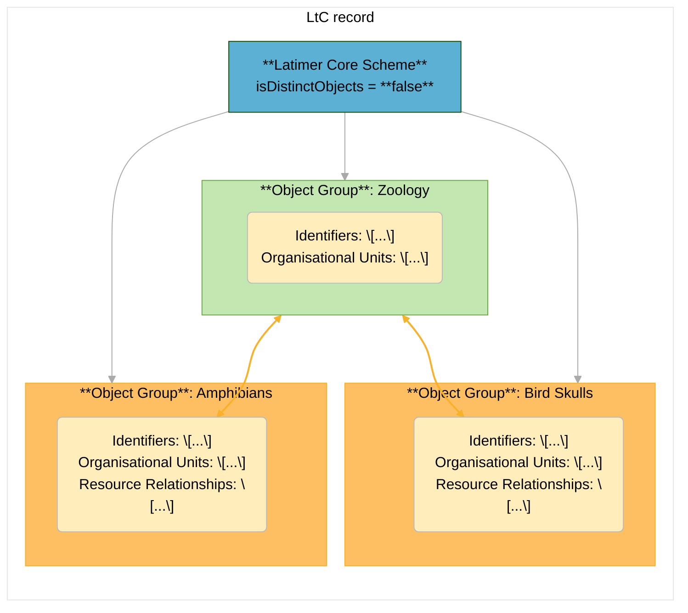

# LtC examples of a Museum's Collections - in JSON

This is an example of how to structure Latimer Core records in JSON-format to represent collections at a museum within a larger organization -- related to the ['Dino University' GRSciColl modeling exercise](https://training.gbif.org/en/grscicoll/modelling-exercise).

An aggregator -- e.g. GrSciColl -- can define a preferred Latimer Core schema using the **ltc:LatimerCoreScheme** class to ensure that contributed records are parsed properly.  The [**`ltc:isDistinctObjects`**](https://ltc.tdwg.org/terms/#LatimerCoreScheme_isDistinctObjects) term will indicate to data-publishers whether Object Groups within a Latimer Core record should represent distinct or overlapping collections.

## Records with distinct Object Groups
Use this record structure for the GrSciColl example records if they use a Latimer Core Scheme where [**`ltc:isDistinctObjects`**](https://ltc.tdwg.org/terms/#LatimerCoreScheme_isDistinctObjects) is `true`.

Example JSON records:
- [dino_v2a1_isDistinctTRUE.json](./dino_v2a1_isDistinctTRUE.json) - this LtC record includes ObjectGroups for four overall collections: Herbarium, Teaching collection, Paleontology, Rocks.
- [dino_v2a2_isDistinctTRUE.json](./dino_v2a2_isDistinctTRUE.json) - this LtC record includes ObjectGroups for 8 sub-collections: Amphibians, Bird Skulls, Elephant skeleton, Petrified wood, Fossil bivalves, Fossil vertebrates, Sedimentary rocks, Volcanic rocks, Gems.

## Records with overlapping Object Groups
Use this record structure for the GrSciColl example records if they use a Latimer Core Scheme where [**`ltc:isDistinctObjects`**](https://ltc.tdwg.org/terms/#LatimerCoreScheme_isDistinctObjects) is `false`.

For a JSON example, [dino_v2b_isDistinctFALSE.json](./dino_v2b_isDistinctFALSE.json) is an LtC record containing ObjectGroups for four overall collections -- Herbarium, Teaching collection, Paleontology, Rocks -- as well as ObjectGroups for their respective subcollections.

**Note:**  
**ltc:ObjectGroup** classes cannot be nested within each other in a Latimer Core record. Instead, they should reference identifiers for related **ltc:ObjectGroup** using the **ltc:ResourceRelationship** class.

## What about Organisational Units?

How should related departments or other institutional or administrative areas be structured in Latimer Core?  This can seem complicated for collections with details about multiple levels of sub-collections and/or departmental areas, but a few LtC terms and record-structures can help data publishers, aggregators and users.

- The [`ltc:basisOfRecord`](http://rs.tdwg.org/ltc/terms/basisOfScheme) term in the `LatimerCoreScheme` Class indicates what a given LtC record represents (e.g. an `Institution` vs a `Collection`).
- A `Collection` LtC record's ObjectGroup can use the [`ltc:OrganisationalUnit`](https://ltc.tdwg.org/terms/#ObjectGroup_hasOrganisationalUnit) Class to reference the identifiers of related department or administrative area without documenting the whole organisational hierarchy.  This is similar to how a Darwin Core Occurrence dataset can use [`dwc:eventId`](http://rs.tdwg.org/dwc/terms/eventID) to reference Darwin Core Events rather than trying to document entire project contexts within each occurrence record.

