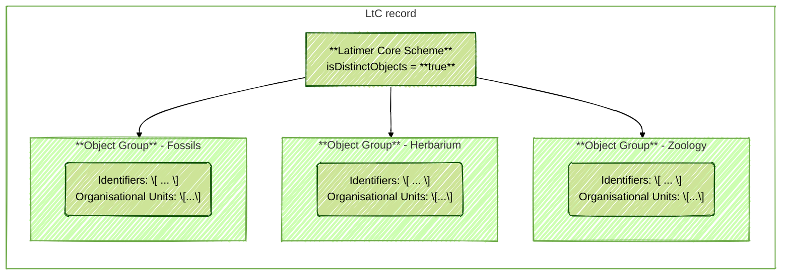
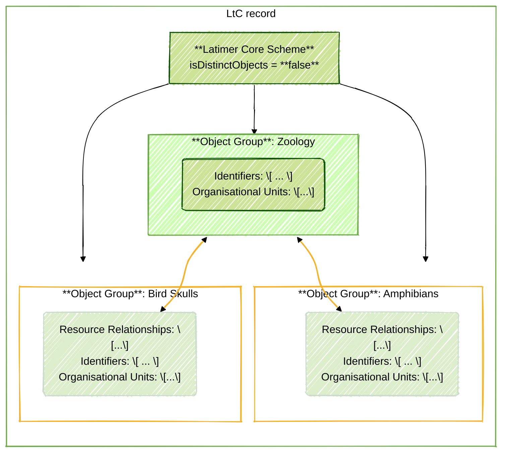

# GrSciColl - Aggregator schema example

This is an example of how to structure LtC records in JSON-format to represent collections at a museum within a larger organization.

An aggregator -- e.g. GrSciColl -- can define a preferred Latimer Core schema using the **ltc:LatimerCoreScheme** class to ensure that contributed records are parsed properly.  The [**`ltc:isDistinctObjects`**](https://ltc.tdwg.org/terms/#LatimerCoreScheme_isDistinctObjects) term will indicate to data-publishers whether Object Groups within a Latimer Core record should represent distinct or overlapping collections.

## Records with distinct Object Groups
Use this record structure for the GrSciColl example records if they use a Latimer Core Scheme where [**`ltc:isDistinctObjects`**](https://ltc.tdwg.org/terms/#LatimerCoreScheme_isDistinctObjects) is `true`.

## Records with overlapping Object Groups
Use this record structure for the GrSciColl example records if they use a Latimer Core Scheme where [**`ltc:isDistinctObjects`**](https://ltc.tdwg.org/terms/#LatimerCoreScheme_isDistinctObjects) is `false`.

Note: 
- **ltc:ObjectGroup** classes cannot be nested within each other in a Latimer Core record. Instead, they should reference identifiers for related **ltc:ObjectGroup** using the **ltc:ResourceRelationship** class.

